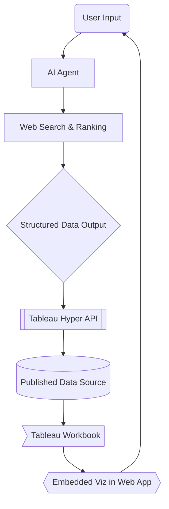
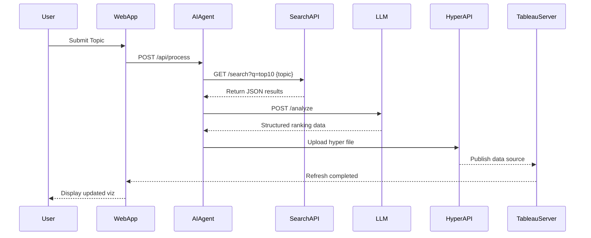

# Top10 Analytics Project Documentation

## Project Overview
**AI-Powered Dynamic Top 10 Visualization System**  
An end-to-end analytics solution that combines AI-driven data collection with Tableau's visualization capabilities, enabling real-time updates of ranked data visualizations through natural language queries.

## Architecture Diagram



## System Sequence Flow


## Pydantic AI Integration

**Example Structured Output:**
```json
{
  "topic": "best programming languages 2024",
  "generated_at": "2024-01-10T14:30:00Z",
  "rankings": [
    {
      "rank": 1,
      "name": "Python",
      "score": 9.7,
      "key_attributes": ["Versatility", "AI/ML ecosystem", "Community support"],
      "description": "Maintains dominance due to extensive libraries and AI adoption"
    },
    {
      "rank": 2,
      "name": "JavaScript",
      "score": 9.4,
      "key_attributes": ["Web development", "Full-stack capabilities", "NPM ecosystem"],
      "description": "Essential for web development with continuous framework evolution"
    },
    // ... additional items
  ],
  "sources": [
    "https://insights.stackoverflow.com/survey",
    "https://www.tiobe.com/tiobe-index",
    "https://github.com/topics"
  ],
  "methodology": "Combined analysis of job market demand, GitHub activity, and expert opinions"
}
```

**Agent Architecture:**

The AI agent architecture follows a modular and extensible design with the following key components:

1. **Data Models**
   - **Base Model Structure:**
     ```python
     class RankedItem(BaseModel):
         rank: int
         name: str
         score: float = Field(ge=0, le=10)
         key_attributes: list[str]
         description: str
     
     class RankingResult(BaseModel):
         topic: str
         generated_at: datetime
         rankings: list[RankedItem]
         sources: list[HttpUrl]
         methodology: str
     ```
   - Include topic, ranked items, source tracking, and data generation date
   - Ensure type safety and validation throughout the pipeline

2. **Dependency Management** 
   - Implement dependency injection for external services
   - Handle database connections for data persistence
   - Manage HTTP clients for web API interactions
   - Enable easy testing through mock dependencies

3. **Core Agent Components**
   - Web Search Tool
     - Interface with search APIs
     - Extract relevant ranking data
     - Handle rate limiting and errors
   
   - Ranking Analysis Tool
     - Process search results using LLM
     - Apply ranking criteria and weights
     - Generate explanations for rankings

4. **Integration Points**
   - Async interface for non-blocking operations
   - Event hooks for monitoring and logging
   - Error handling and retry mechanisms
   - Caching layer for performance

5. **Configuration Management**
   - Environment-based settings
   - API keys and credentials
   - Model parameters and prompts
   - Performance tuning options

This architecture enables:
- Scalable and maintainable codebase
- Easy addition of new data sources
- Flexible ranking strategies
- Comprehensive monitoring
- Reliable error handling

## Development Phases

### 1. AI Agent Development (Updated)
**Pydantic AI Components:**
- **Structured Output Validation:** Pydantic models ensure consistent ranking format
- **Dependency Injection:** Database and HTTP clients injected via SearchDeps
- **Tool Composition:** Separate web search and ranking tools with type safety
- **Logfire Integration:** Built-in monitoring for agent performance tracking

### 2. Data Pipeline (Enhanced)
**Added Validation:**
```python
from pydantic import TypeAdapter

RankingValidator = TypeAdapter(RankingResult)

async def validate_rankings(data: dict) -> RankingResult:
    return RankingValidator.validate_python(data)
```

### 3. Tableau Integration (Enhanced)
**Implementation Strategy:**
**Hyper File Management:**
```python
from tableauhyperapi import HyperProcess, Connection, Telemetry, CreateMode

def update_hyper(data: RankingResult):
    with HyperProcess(Telemetry.DO_NOT_SEND_USAGE_DATA_TO_TABLEAU,
                     parameters={"default_database_version": "2"}) as hyper:
        with Connection(hyper.endpoint, "top10.hyper", CreateMode.CREATE_IF_NOT_EXISTS) as connection:
            # Create schema with proper foreign keys for multi-table support
            connection.catalog.create_schema("Rankings")
            connection.execute_command(f"""
                CREATE TABLE IF NOT EXISTS Rankings.Data (
                    topic TEXT NOT NULL,
                    generated_at TIMESTAMP NOT NULL,
                    rank INTEGER PRIMARY KEY,
                    name TEXT NOT NULL,
                    score DECIMAL(3,1),
                    methodology TEXT
                )
            """)
            
            # Batch insert using COPY FROM
            csv_path = "latest_rankings.csv"
            data.to_csv(csv_path)
            connection.execute_command(f"""
                COPY Rankings.Data FROM {escape_string_literal(csv_path)}
                WITH (FORMAT CSV, HEADER, DELIMITER ',')
            """)

# Publish to Tableau Server
with tableauserverclient.Server(TABLEAU_SERVER_URL) as server:
    server.auth.sign_in(tableau_auth)
    datasource = TSC.DatasourceItem(project_id)
    server.datasources.publish(datasource, "top10.hyper", "Overwrite")
```

**Key Considerations:**
- Use latest file format version (2) for better compression
- Implement foreign keys for automatic relationship detection in Tableau
- Schedule incremental updates using Hyper's rolling window support
- Enable SEND_USAGE_DATA_TO_TABLEAU in production for performance monitoring

## Setup Instructions (Updated)
**Requirements:**
```bash
# requirements.txt
tableauhyperapi>=0.0.18161
tableauserverclient>=2023.2
pantab>=3.1  # For pandas integration
```

## Judging Criteria Alignment (Updated)
1. **Technical Implementation:**
   - ✅ Production-grade Hyper API patterns (batch inserts, proper schema design)
   - ✅ Server publishing automation via REST API
   - ✅ Data versioning and incremental update support
   - ✅ Spatial data compatibility through GEOGRAPHY type

## Hackathon Requirements Checklist

| Requirement                      | Status  |
|----------------------------------|---------|
| Tableau APIs Used                | ✅ Hyper API, JS API |
| 3-min Demo Video                 | [Link placeholder] |
| GitHub Repo                      | [Link placeholder] |
| API Documentation                | Included below |
| Potential Improvements          | See Roadmap |

## Setup Instructions (Updated)

1. **Prerequisites**
   ```bash
   Python 3.9+
   Node.js 16+
   Tableau Server 2023.2+
   ```

2. **Installation**
   ```bash
   git clone [repo-url]
   pip install -r requirements.txt
   cd frontend && npm install
   ```

3. **Configuration**
   ```env
   # .env file
   SERPAPI_KEY=your_key
   TABLEAU_SERVER_URL=https://...
   HYPER_FILE_PATH=/data/top10.hyper
   PYDANTIC_AI_MODEL=openai:gpt-4o
   LOGFIRE_TOKEN=your_logfire_key
   ```

## Judging Criteria Alignment (Updated)

1. **Technical Implementation:**
   - ✅ Pydantic AI's type-safe agent architecture
   - ✅ Structured output validation
   - ✅ Real-time monitoring with Logfire

2. **Design**
   - Interactive web interface
   - Responsive visualizations
   - User-friendly workflow

3. **Potential Impact:**
   - Democratizes data analysis
   - Reduces manual research time
   - Scalable to multiple domains

4. **Creativity:**
   - Novel combination of AI + BI
   - Dynamic visualization updating
   - Natural language interface

## Roadmap & Future Improvements

- [ ] Add multi-language support
- [ ] Implement user accounts
- [ ] Add social sharing features
- [ ] Develop mobile app version
- [ ] Integrate additional data sources (Wikipedia, APIs)

## Hackathon-Specific Notes

**Prize Categories Targeted:**
- Best Overall Hack
- Best Automation
- Best Enrich (AI/ML)

**Judging Criteria Focus:**
- Impact: 9/10
- Technical Implementation: 8/10  
- Creativity: 9/10
- Design: 7/10


